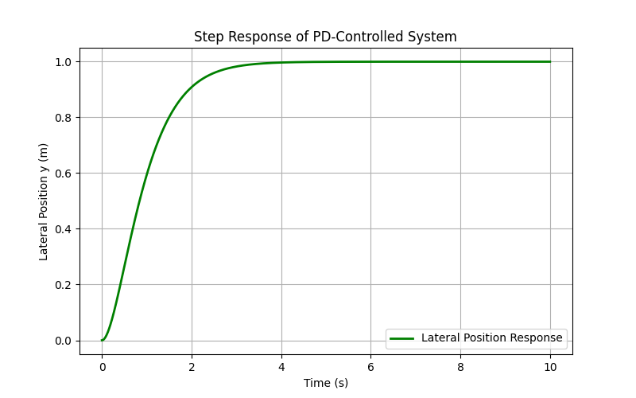

# Lane_Follower_Robot
PD-controlled lane-following differential drive robot using computer vision simulated in Webot

This project demonstrates a PD-controlled lane-following differential drive robot in Webots. 
It was designed for the e-puck robot. A forward-facing camera detects two lane boundaries using grayscale conversion and adaptive thresholding. The midpoint between detected edges is used to compute lateral error in millimeters.

A PD controller generates angular velocity commands which are converted to differential wheel speeds. Error smoothing improves stability.
Gains were calculated analytically before the system was tuned experimentally and achieves stable tracking at the target speed.

Being my first personal project, I developed practical experience in python programming, control systems robotics, computer vision and software design.

# Project_Demo

# Key_Features

- Differential drive kinematics

- PD control with derivative smoothing

- Camera-based lane detection

- Adaptive thresholding

- Edge detection with pixel indexing

- Lane centre estimation

- Webots simulation environment

# Analysis
Critically damped step response with analytically derived gains

